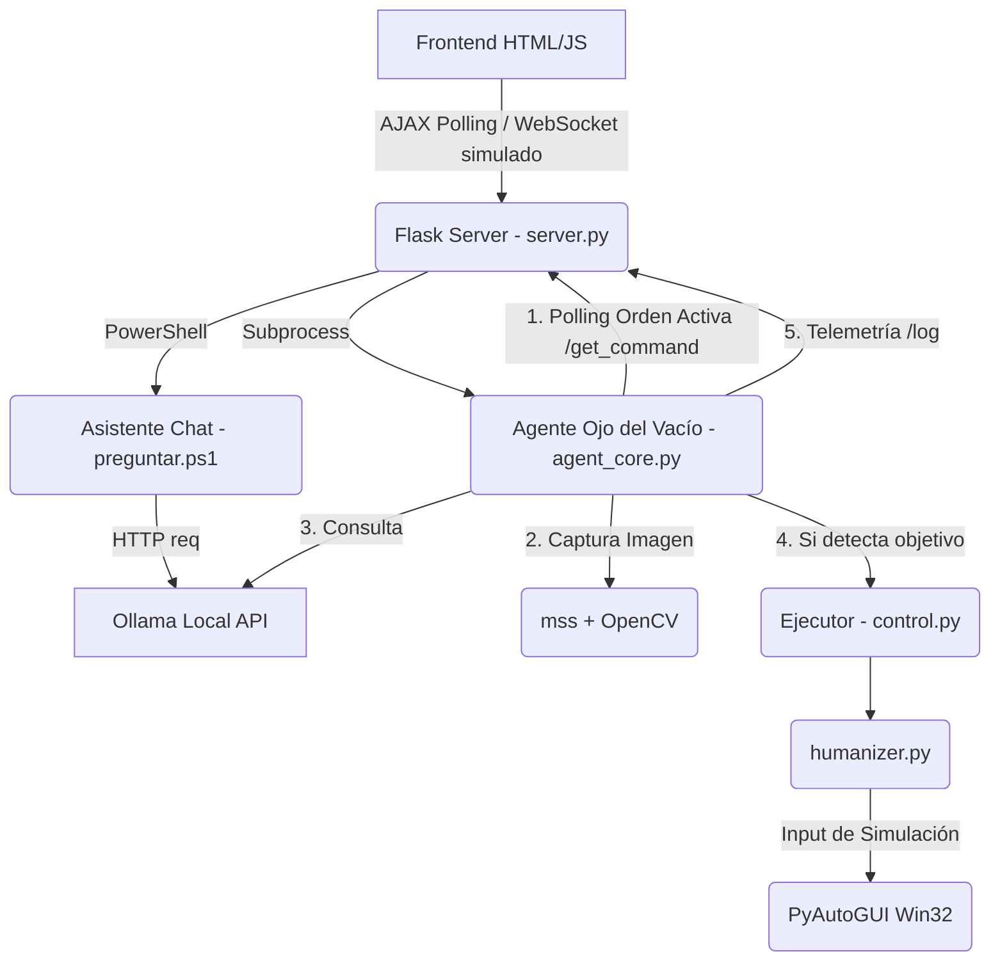

# Arquitectura del Sistema PUENTE

Este documento expone cómo se comunican las distintas partes del sistema PUENTE. 
Es una arquitectura asíncrona liderada por Flask que orquesta la captura de imagen, las solicitudes locales a modelos de ML y la ejecución de ratón/teclado.

## Diagrama de Componentes

## Módulos Core

1. **`server.py`**: El backend en Flask. Guarda en memoria ram el comando actual (`last_command`), sirve las páginas, maneja el Pánico Absoluto (matando subprocesos) e interconecta todas las piezas.
2. **`agent_core.py`**: El bucle infinito del Esbirro. No hace nada hasta que el servidor recibe de la web una ORDEN DE COMBATE (guardado en Flask). Ahí empieza a ciclar sobre capturas de pantalla de bajo peso que se mandan a Moondream por local HTTP junto con el prompt.
3. **`control.py` & `humanizer.py`**: Aislados en un script `argparse`. Esto facilita invocar ratón/teclado de forma humana desde PowerShell, JS, Agente u otras interrupciones externas sin acoplarse y arrancar un ecosistema gordo de imports cruzados.
4. **`app.js`**: Telemetría reactiva en el frontend evaluando logs en tiempo real (`setInterval`).
